# ArchiSegNet Dataset

This repository presents sample images from the ArchiSegNet dataset, covering multiple facade image types and visual representations.

<table>
  <tr>
    <td align="center">
      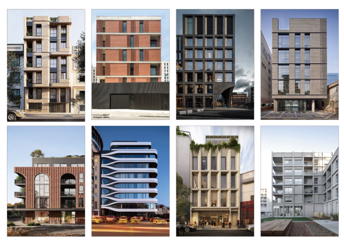 
      Realistic Image_completed
    </td>
    <td align="center">
      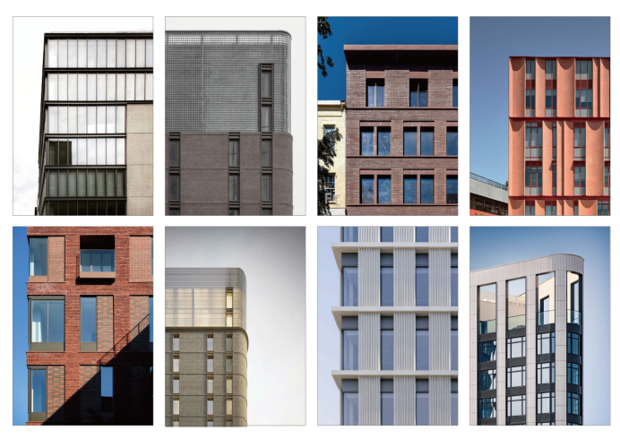 
      Realistic Image_partial
    </td>
    <td align="center">
      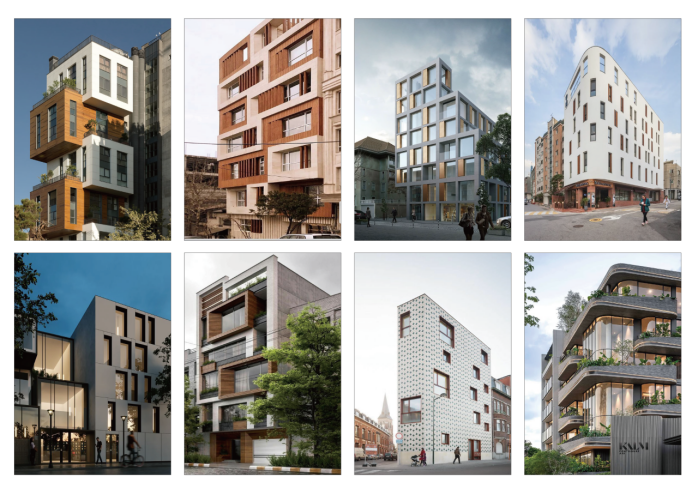 
      Perspective Image
    </td>
  </tr>
  <tr>
    <td align="center">
      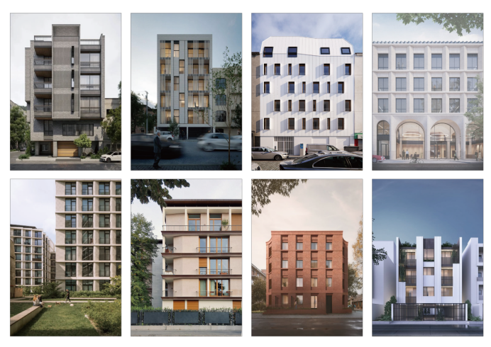 
      Render Image
    </td>
    <td align="center">
      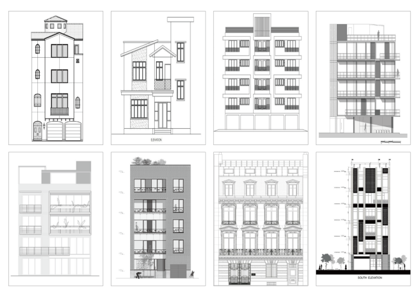 
      CAD Image
    </td>
    <td align="center">
      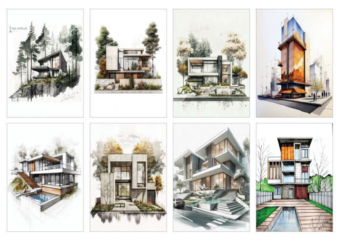 
      Pen Drawing Image
    </td>
  </tr>
  <tr>
    <td align="center">
      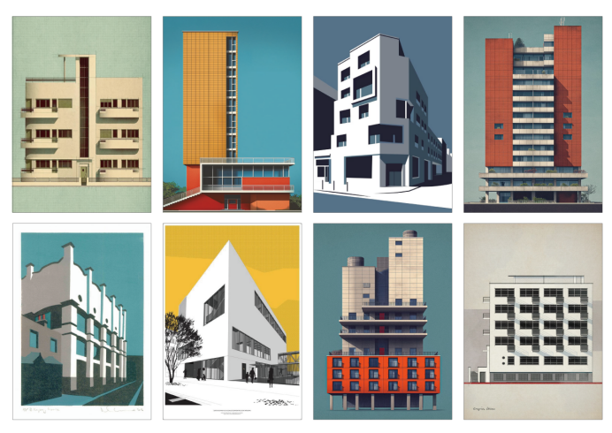 
      Illustration Image
    </td>
    <td align="center">
      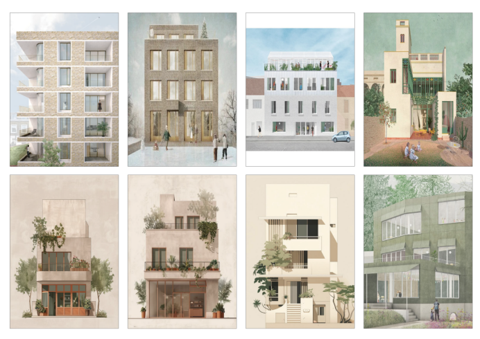 
      Watercolor Image
    </td>
    <td align="center">
      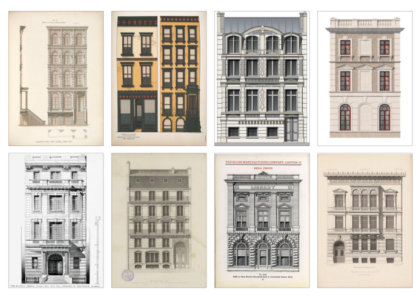 
      Book Image
    </td>
  </tr>
  <tr>
    <td align="center">
      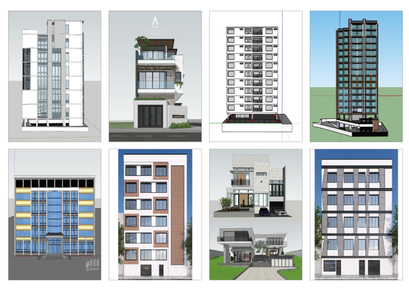 
      Digital Model Image
    </td>
    <td align="center">
      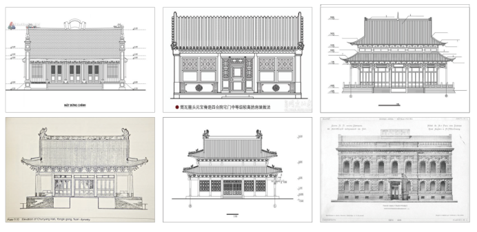 
      Historical Document Image
    </td>
    <td align="center">
    </td>
  </tr>
</table>
